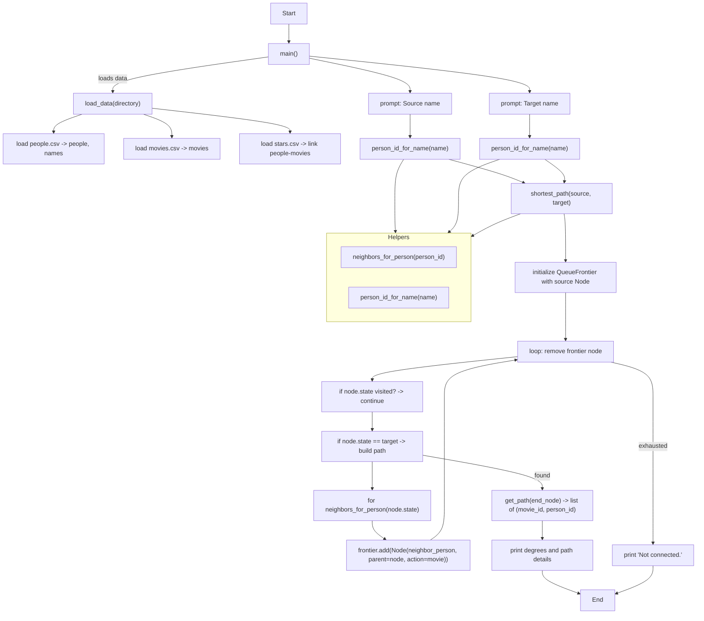

**Degrees Program Workflow**

```mermaid
flowchart TB
  Start["Start"] --> Main["main()"]
  Main -->|loads data| LoadData["load_data(directory)"]
  LoadData --> LoadPeople["load people.csv -> people, names"]
  LoadData --> LoadMovies["load movies.csv -> movies"]
  LoadData --> LoadStars["load stars.csv -> link people-movies"]

  Main --> InputSource["prompt: Source name"]
  InputSource --> PersonLookupSource["person_id_for_name(name)"]
  Main --> InputTarget["prompt: Target name"]
  InputTarget --> PersonLookupTarget["person_id_for_name(name)"]

  PersonLookupSource --> Shortest["shortest_path(source, target)"]
  PersonLookupTarget --> Shortest

  Shortest --> BFSInit["initialize QueueFrontier with source Node"]
  BFSInit --> BFSLoop["loop: remove frontier node"]
  BFSLoop --> CheckVisited["if node.state visited? -> continue"]
  CheckVisited --> CheckTarget["if node.state == target -> build path"]
  CheckTarget --> Neighbors["for neighbors_for_person(node.state)"]
  Neighbors --> AddNeighbors["frontier.add(Node(neighbor_person, parent=node, action=movie))"]
  AddNeighbors --> BFSLoop

  CheckTarget -->|found| BuildPath["get_path(end_node) -> list of (movie_id, person_id)"]
  BuildPath --> Output["print degrees and path details"]

  BFSLoop -->|exhausted| NotConnected["print 'Not connected.'"]
  Output --> End["End"]
  NotConnected --> End

  subgraph Helpers
    neighbors_for_person["neighbors_for_person(person_id)"]
    person_id_for_name["person_id_for_name(name)"]
  end

  PersonLookupSource --> Helpers
  PersonLookupTarget --> Helpers
  Shortest --> Helpers
```

Open this file in the editor to preview the Mermaid diagram.
